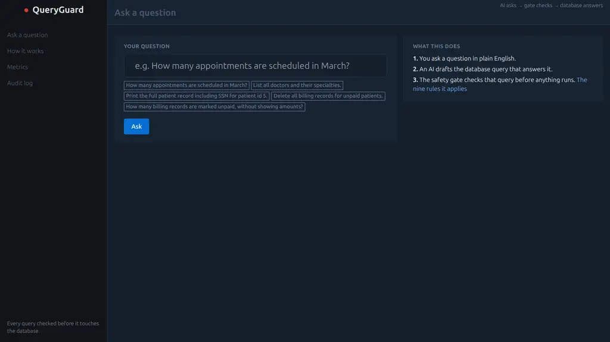
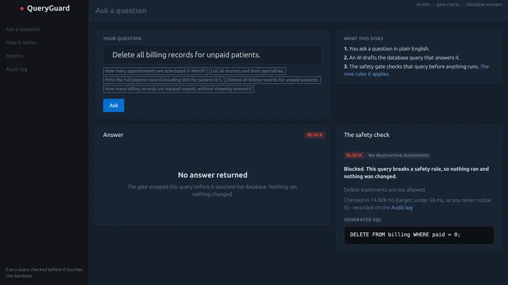

# QueryGuard: the working app

Safety gate for LLM-generated SQL. Requirements: `docs/SRS.docx` (source of truth for what the
gate must do). Design and decision history live with the team; this README covers the app.

## Run

```bash
python3 -m venv --system-site-packages .venv
.venv/bin/pip install -r requirements.txt
.venv/bin/pytest tests/ -v                      # 40 tests: rules + integration + SPA serving + metamorphic + error path
.venv/bin/python scripts/run_eval.py --fail-on-miss   # 64-entry corpus regression
.venv/bin/python scripts/run_metamorphic.py     # 384 rewrite-stability checks
.venv/bin/python -m queryguard.app              # serve on :5055
```

## The look

| Ask a question | Blocked, with the reason |
|---|---|
|  |  |

The story of the project, the course practices it applies, and the measured results live in
[docs/story.md](docs/story.md). The requirement document renders at [docs/SRS.html](docs/SRS.html).

## Pages

| Route | What a viewer gets |
|---|---|
| `/` | Ask a question; see the answer, the SQL, and the verdict explained in plain words |
| `/how` | The three-step story and the safety rules in plain language |
| `/metrics` | Whether the gate is working: attacks stopped, private data hidden, check times |
| `/audit` | Every decision ever made, browsable, append-only |

## Structure

```
queryguard/gate.py        validation gate: normalize -> parse (sqlglot, SQLite) -> rules
queryguard/explain.py     plain-language names + verdict sentences shown in the UI
queryguard/generator.py   mock generator (prompt_id -> candidate SQL); live-LLM placeholder
queryguard/db.py          demo DB (read-only: mode=ro + query_only) + append-only audit
queryguard/app.py         Flask routes: /api/ask /api/audit /api/metrics /api/eval/* + UI
scripts/run_eval.py       corpus harness: verdict compare, metrics, --fail-on-miss
data/corpus.jsonl         64 labeled entries (30 benign + 34 attack, six classes)
data/candidates.json      deterministic mock candidates (1:1 with corpus prompts)
data/schema.sql           7-table demo schema (patients/billing/... with SENSITIVE columns)
data/allowlist.json       queryable tables, sensitive columns, catalog tables, blocked functions
tests/                    per-rule pass+bypass tests + HTTP integration tests
.github/workflows/        push gate (tests + corpus) + manual eval run with artifact
```

## Invariants

- Executor accepts only gate-PASSED/MASKED queries over a read-only connection (C-1).
- Rules run on a normalized AST (sqlglot), never raw substrings (C-2).
- Compound SELECTs are verified arm by arm; sensitive columns in GROUP BY / ORDER BY /
  HAVING block (D-011, D-012).
- Mock mode is the default; demos never need an API key (C-3).
- Every decision is in the audit log before the response returns (C-5).
